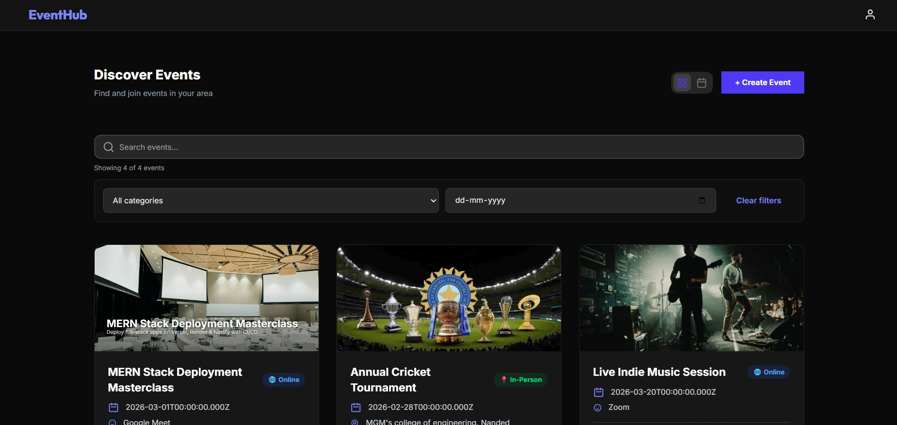
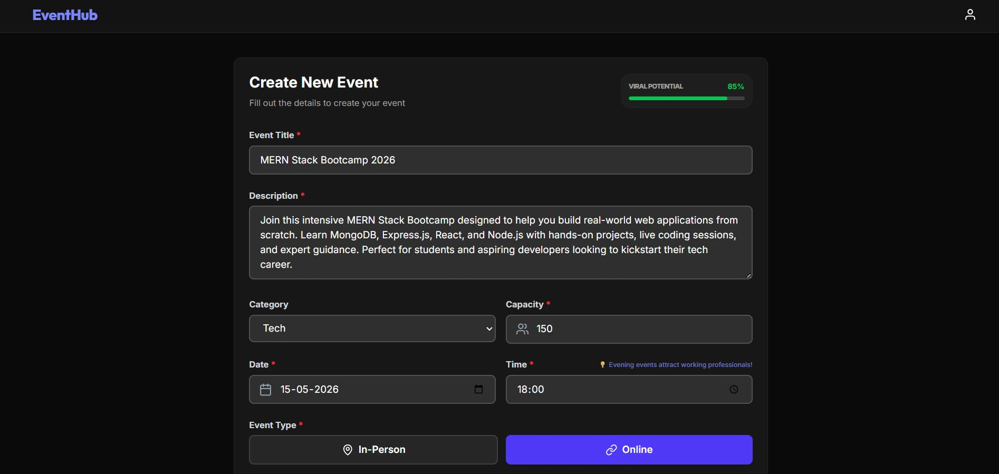
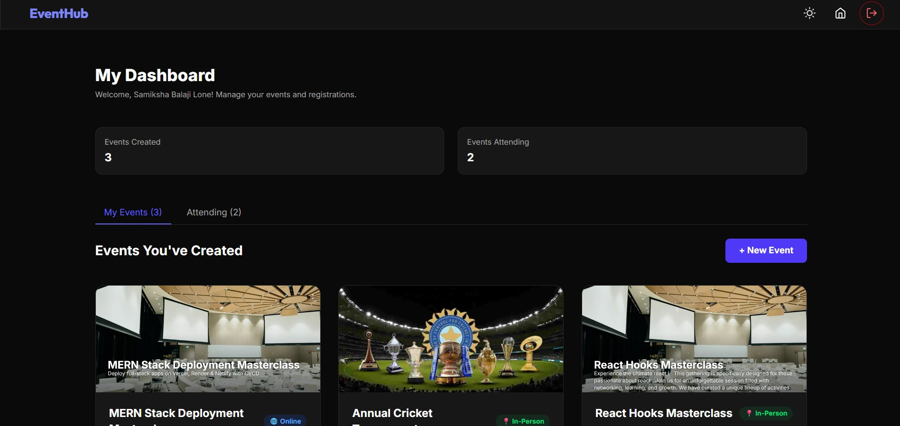

# EventHub — Event Management Platform

> A full-stack MERN application for discovering, creating, and managing events with real-time RSVP capacity enforcement.

## 🔗 Links
- **Live Demo**: [https://eventhub-eight.vercel.app/](https://eventhub-eight.vercel.app/)
- **GitHub Repository**: [https://github.com/Samiksha-Lone/event-platform](https://github.com/Samiksha-Lone/event-platform)

## Overview

EventHub is a centralized platform where users can create and discover both online and offline events, RSVP with real-time capacity management, and engage with a community through profiles and favorites.

## Problem Statement

- Event organizers lack a single platform to manage online and offline events together
- Attendees struggle to discover events that match their interests and availability
- Manual RSVP tracking is unreliable and prone to over-booking

## Solution

EventHub solves this with centralized event discovery, smart filtering, and a real-time RSVP system that enforces capacity limits automatically — all wrapped in a clean, responsive interface.

## Key Features

- 🔐 **Authentication** — JWT + HTTP-only cookies, rate-limited login
- 📅 **Event Management** — Create, edit, delete events with image uploads (ImageKit CDN)
- ✅ **RSVP System** — Real-time capacity enforcement; join or leave events instantly
- 🔍 **Smart Discovery** — Search, category & date filtering, pagination
- 👤 **User Dashboard** — Manage hosted events and track attended events
- 📧 **Email Service** — Password recovery via Nodemailer
- 🛡️ **Security** — bcryptjs hashing, input sanitization, rate limiting, CORS, Helmet.js
- 📱 **Responsive UI** — Dark mode, mobile-optimized layout

## Tech Stack

| Layer | Technology |
|---|---|
| **Frontend** | React 19, Vite 7, Tailwind CSS 4, React Router 7 |
| **Backend** | Node.js 18+, Express 5, Mongoose 9 |
| **Database** | MongoDB Atlas |
| **Auth & Security** | JWT, bcryptjs, Helmet.js, express-rate-limit |
| **Storage** | ImageKit (CDN image hosting) |
| **Email** | Nodemailer (SMTP) |
| **State Management** | Context API |
| **Deployment** | Vercel (frontend), Render (backend) |-

## Architecture / Flow

```
User → React Frontend → Context API → Axios → Express API → MongoDB
                                                    ↓
                                         JWT Auth · Rate Limiting
                                         Input Validation · ImageKit
```

## My Contribution

**I independently designed and built this entire project from scratch**, including:

- 🖥️ **Frontend** — All React components, routing, state management, and responsive UI
- ⚙️ **Backend** — Express server, RESTful APIs, MongoDB schemas, and business logic
- 🔐 **Authentication** — JWT-based auth flow with secure HTTP-only cookies
- 📸 **Media Handling** — ImageKit integration for image uploads and CDN delivery
- 📧 **Email Service** — Password reset flow using Nodemailer
- 🚀 **Deployment** — Environment setup, MongoDB Atlas, and Vercel deployment

## Setup

### Prerequisites
Node.js 18+, npm, MongoDB Atlas account, ImageKit account

### 1. Backend

```bash
cd server
npm install
```

Create a `.env` file:

```env
PORT=3000
MONGO_URI=mongodb+srv://<your-cluster>
JWT_SECRET=your_secret_key
CLIENT_URL=http://localhost:5173
SMTP_USER=your_email@gmail.com
SMTP_PASS=your_app_password
IMAGEKIT_PUBLIC_KEY=...
IMAGEKIT_PRIVATE_KEY=...
IMAGEKIT_URL_ENDPOINT=...
```

```bash
npm run dev   # http://localhost:3000
```

### 2. Frontend

```bash
cd client
npm install
npm run dev   # http://localhost:5173
```

## Screenshots

### Home Page


### Create Event


### User Dashboard


## Future Improvements

- [ ] Real-time notifications using WebSockets
- [ ] Event reviews and ratings system

## License

ISC License — see [LICENSE](LICENSE) for details.

## Credits

**Developed by [Samiksha Lone](https://github.com/Samiksha-Lone)**