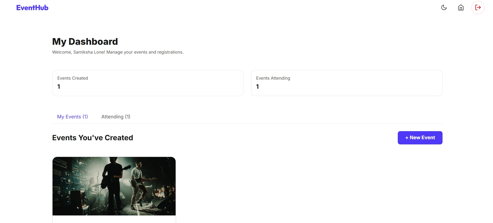

# EventHub

A modern event platform for creating, discovering, and managing events with secure user access and RSVP workflows.

## Links

- 🔗 Live Demo: https://eventhub-eight.vercel.app/
- 📁 GitHub: https://github.com/Samiksha-Lone/event-platform

## Problem Statement

Organizers and attendees need a reliable way to manage local and virtual events while keeping sign-ups, capacity, and event details synchronized across devices. Many event platforms are fragmented, lack real-time RSVP feedback, and do not support easy event marketing assets for organizers.

## Problem–Solution Mapping

| Problem | Solution |
| --- | --- |
| Event discovery is scattered and hard to filter | Centralized event feed with category filters and search |
| RSVP status is unclear and event capacity is not enforced | RSVP system with capacity checks and live attendance counts |
| Event creation is repetitive and content quality varies | Structured event creation flow with easy editing and image support |
| Secure registration and session management are needed | JWT-based authentication with HTTP-only cookies and route protection |
| UI needs to work well on desktop and mobile | Responsive React + Tailwind interface with dark mode |

## What is Implemented

- **User authentication** with registration, login, session persistence, and protected routes
- **Event creation and management** for organizers, including edit and delete flows
- **Event browsing** with search, category filters, and details pages
- **RSVP workflow** with join/cancel options, capacity enforcement, and attendee tracking
- **User dashboard** showing organizer events and attending events in one view
- **Structured event creation** with guided input for descriptions and media
- **Security middleware** including rate limiting, validation, sanitization, and HTTP headers
- **Responsive design** to support mobile, tablet, and desktop devices

## Solution Overview

EventHub is built as a full-stack application with a React frontend and Express/MongoDB backend. The client interacts with a REST API to authenticate users, fetch event data, and update RSVP state. State management is handled via React Context, while backend middleware protects routes and validates incoming requests.

The platform supports both event organizers and attendees:

- Organizers can create event listings, adjust details, and monitor attendance.
- Attendees can search, RSVP, and view upcoming events in a personal dashboard.

## Project Highlights

- Clean product-style front-end built with **React 19** and **Tailwind CSS**
- Secure backend implemented using **Express.js**, **JWT**, and **MongoDB**
- Advanced form validation with **express-validator** and custom validation middleware
- Global state management using **React Context** for auth, events, theme, and notifications
- Protects API access with **rate limiting**, **CORS**, **helmet**, and input sanitization
- Interactive UI with **dark mode**, toast notifications, skeleton loaders, and responsive layout

## Features

- ✅ User registration and secure login
- ✅ Event creation, update, and deletion
- ✅ Search and category filtering for event discovery
- ✅ RSVP management with attendance limits
- ✅ Personal dashboard for created and attending events
- ✅ Guided event creation and media upload support
- ✅ Real-time UI feedback with toast notifications
- ✅ Dark mode and responsive design
- ✅ Backend validation, sanitization, and security middleware

## Screenshots




## Tech Stack

- **Frontend:** React, Vite, Tailwind CSS, React Router, Axios
- **Backend:** Node.js, Express, MongoDB, Mongoose
- **Security:** JWT, bcryptjs, helmet, express-rate-limit, express-mongo-sanitize
- **Media:** Image upload support for event posters and galleries
- **Utilities:** Cookie parser, multer, nodemailer, csurf

## Installation / Setup Steps

1. Clone the repository:

```bash
git clone https://github.com/Samiksha-Lone/event-platform.git
cd event-platform
```

2. Install server dependencies:

```bash
cd server
npm install
```

3. Create and configure server environment variables:

```env
PORT=3000
NODE_ENV=development
MONGO_URI=your-mongodb-connection-string
JWT_SECRET=your-secret-key
CLIENT_URL=http://localhost:5173
```

4. Start the backend:

```bash
npm run dev
```

5. Install frontend dependencies in a second terminal:

```bash
cd ../client
npm install
npm run dev
```

6. Open the app at:

```bash
http://localhost:5173
```

## Key Learnings

- Built a full-stack event management product with end-to-end authentication and access control
- Implemented reliable RSVP capacity checks and event attendance workflows
- Used React Context to coordinate client-side state across multiple pages
- Added developer-friendly backend protections using validation, rate limiting, and sanitization
- Delivered a modern UI experience with responsive layouts, dark mode, and modal-driven workflows

## Future Improvements

- Add real-time event updates with WebSockets
- Implement richer organizer analytics and reporting
- Add email / SMS notifications for RSVP updates
- Enable calendar export and ticketing workflows
- Add multi-language support and improved accessibility

## 📬 Contact

**Samiksha Balaji Lone**  
📧 samikshalone2@gmail.com  
🔗 [LinkedIn](https://linkedin.com/in/samiksha-lone) | [Portfolio](https://samiksha-lone.vercel.app/)